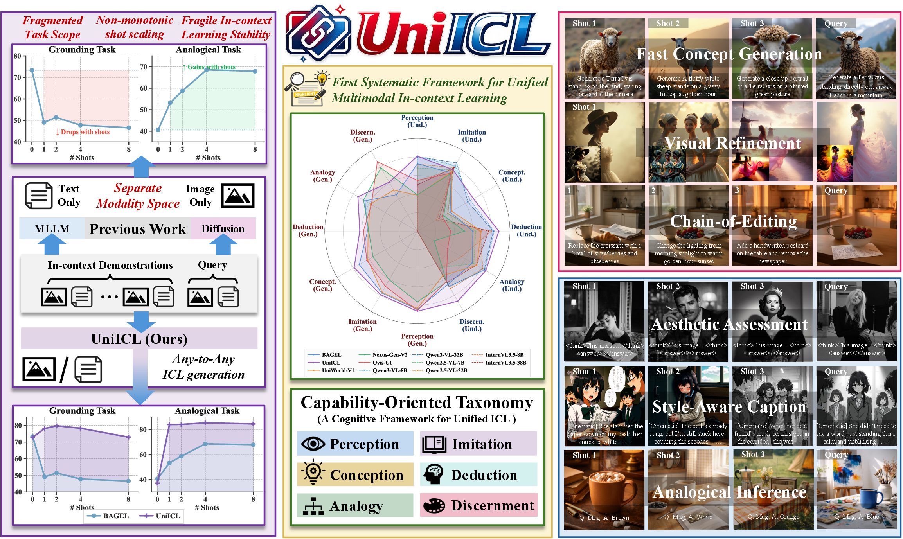
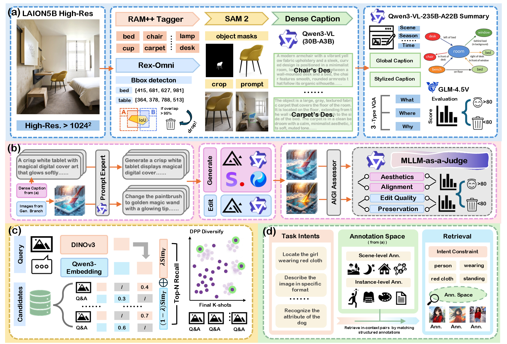
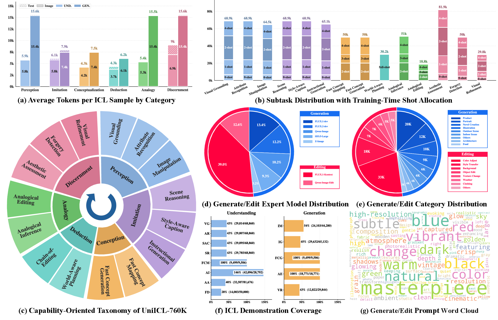
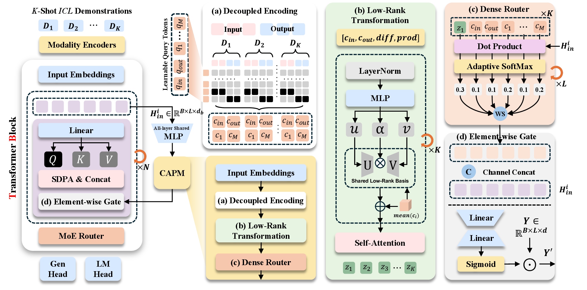
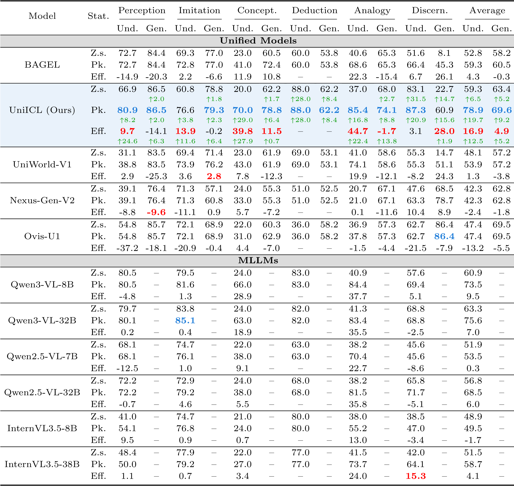
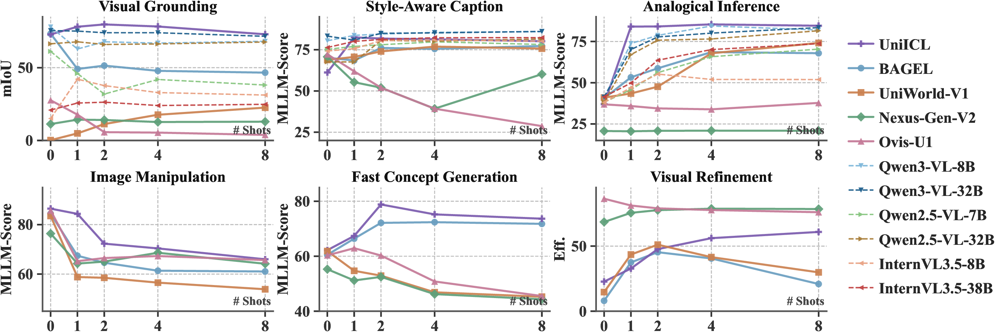
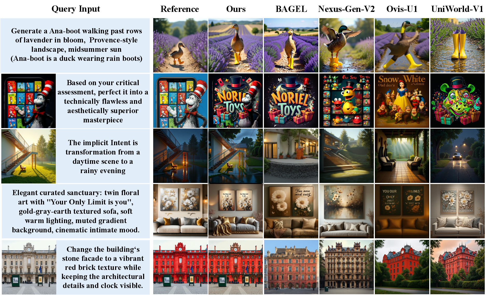

<div align="center">
  <h1>UniICL: Systematizing Unified Multimodal In-context Learning through a Capability-Oriented Taxonomy</h1>
</div>

<p align="center">
  <strong>Yicheng Xu<sup>1</sup></strong> &middot;
  <strong>Jiangning Zhang<sup>1,* ,&dagger;</sup></strong> &middot;
  <strong>Zhucun Xue<sup>1</sup></strong> &middot;
  <strong>Teng Hu<sup>2</sup></strong> &middot;
  <strong>Ran Yi<sup>2</sup></strong> &middot;
  <strong>Xiaobin Hu<sup>3</sup></strong> &middot;
  <strong>Yong Liu<sup>1,&dagger;</sup></strong> &middot;
  <strong>Dacheng Tao<sup>4</sup></strong>
</p>

<p align="center">
  <strong><sup>1</sup>Zhejiang University</strong> &nbsp;&nbsp;
  <strong><sup>2</sup>Shanghai Jiaotong University</strong> &nbsp;&nbsp;
  <strong><sup>3</sup>National University of Singapore</strong> &nbsp;&nbsp;
  <strong><sup>4</sup>Nanyang Technological University</strong>
</p>

<p align="center">
  <sup>*</sup>Equal contributions &nbsp;&nbsp;
  <sup>&dagger;</sup>Corresponding authors
</p>

<p align="center">
  <a href="https://arxiv.org/abs/2603.24690">
    
  </a>
  <a href="https://huggingface.co/datasets/xuyicheng-zju/UniICL-760K">
    
  </a>
  <a href="https://huggingface.co/xuyicheng-zju/UniICL">
    
  </a>
  
</p>

<p align="center">
  
</p>

<p align="center">
  <em>Previous fragmented paradigms isolate modalities and tasks, often suffering from non-monotonic shot scaling. UniICL mitigates this issue through a capability-oriented taxonomy, UniICL-760K, UniICL-Bench, and CAPM.</em>
</p>

## TODO

✅ `UniICL-760K` Dataset Released.  
⏳ Inference & Training code.

## Highlights

- **Capability-Oriented Taxonomy.** Diagnosing ICL failure modes requires a capability-oriented perspective. We introduce a six-level taxonomy that systematically structures ICL tasks by the functional role of demonstrations: perception, imitation, conception, deduction, analogy, and discernment.
- **Unified Multimodal ICL Data and Benchmark.** Guided by this taxonomy, we construct `UniICL-760K`, the first large-scale dataset specifically targeting unified multimodal ICL, comprising 766,868 curated episodes across 15 subtasks. From this collection, we derive `UniICL-Bench`, serving as the first cognitively structured testbed to systematically evaluate multi-dimensional ICL capabilities and stability in up to 8-shot settings.
- **Context-Adaptive Prototype Modulator.** Standard self-attention mechanisms remain susceptible to cross-modal noise in dense contexts. CAPM explicitly models the input-output relationship within demonstrations, converts raw examples into disentangled dynamic representations, and injects them into the backbone through context-adaptive routing.
- **Strong Unified Results.** Evaluations on `UniICL-Bench` show that UniICL achieves state-of-the-art performance across unified baselines, and cross-benchmark validation further demonstrates strong generalization beyond the internal benchmark.
- **Release Status.** Public datasets and model weights are available on Hugging Face. Code is coming soon.

## Data Pipeline

<p align="center">
  
</p>

<p align="center"><em>UniICL-760K curation pipeline: dense annotation, generative synthesis, quality filtering, and task-aligned demonstration retrieval.</em></p>

## Dataset Statistics

<p align="center">
  
</p>

<p align="center"><em>Statistical distributions of UniICL-760K from various perspectives.</em></p>

## CAPM

<p align="center">
  
</p>

<p align="center"><em>CAPM adapts existing Transformer-based models via a four-stage pipeline.</em></p>

## Main Results

<p align="center">
  
</p>

<p align="center"><em>Aggregated main results across the six capability categories. Pk. denotes peak over 0/1/2/4/8-shot, and Eff. denotes ICL efficiency.</em></p>

### ICL Curves

<p align="center">
  
</p>

<p align="center"><em>k-shot performance curves for a subset of tasks.</em></p>

## Qualitative Visualization

<p align="center">
  
</p>

<p align="center"><em>Qualitative comparison of generative ICL tasks: Fast Concept Generation, Visual Refinement, Analogical Editing, Instructional Generation, and Image Manipulation.</em></p>

## Citation

If you find UniICL useful for your research, please cite:

```bibtex
@article{xu2026uniicl,
  title={UniICL: Systematizing Unified Multimodal In-context Learning through a Capability-Oriented Taxonomy},
  author={Xu, Yicheng and Zhang, Jiangning and Xue, Zhucun and Hu, Teng and Yi, Ran and Hu, Xiaobin and Liu, Yong and Tao, Dacheng},
  journal={arXiv preprint arXiv:2603.24690},
  year={2026}
}
```
